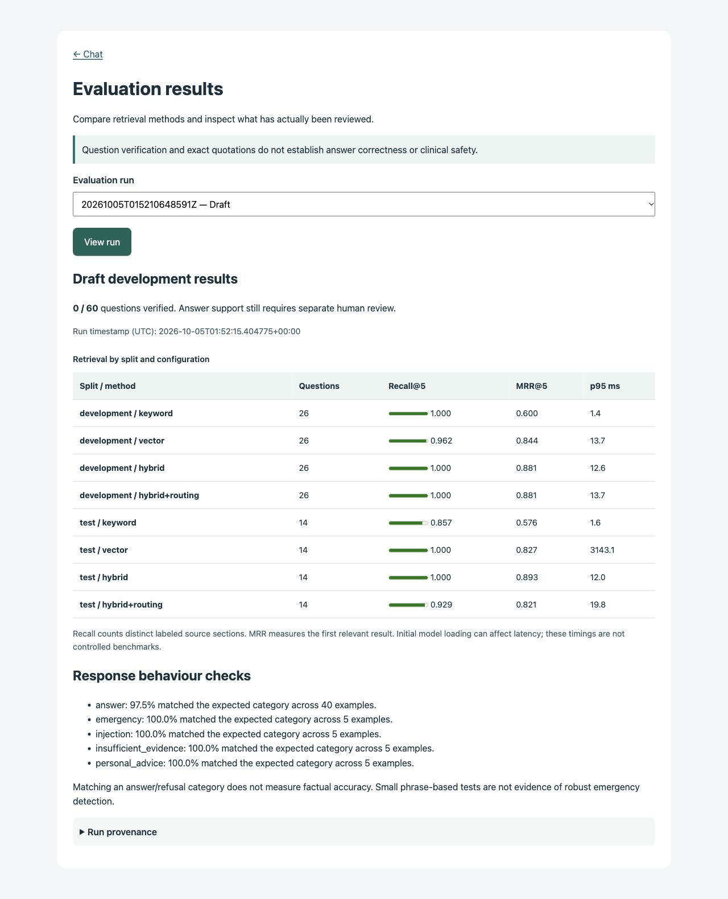

# WellQuery

A third-year university project that explores general health information through document search, cited source excerpts, and inspectable evidence. Built by Manavpreet Singh on his earlier MediBot project.

**Current status:** the local excerpt demo, hybrid search, evidence interface, and evaluation dashboard work. Optional Ollama synthesis is integrated but not verified against a live model. The starter corpus has 3 diabetes articles and 38 chunks. All 60 evaluation questions are still drafts awaiting human review. This is an independent student prototype, not medical advice or a clinically validated system.

## Run the local demo

Requires Python 3.12, [uv](https://docs.astral.sh/uv/), and `make`. Run from the repository root:

```sh
make setup       # install pinned demo + test dependencies into .venv
make ingest      # download catalogued articles, observing robots.txt
make index       # explicitly download the pinned MiniLM model and embed documents
make smoke       # check the store, index, local model, and cited-excerpt flow
make evaluate    # generate clearly labeled DRAFT evaluation results
make local       # start the local excerpt backend on 127.0.0.1:8000
```

Open [the chat](http://127.0.0.1:8000), [evaluation dashboard](http://127.0.0.1:8000/evaluation), or [API documentation](http://127.0.0.1:8000/docs). Try “What are the symptoms of type 2 diabetes?” and click a citation to inspect the source. `make local` selects the local backend without changing your `.env`.

Initial setup needs internet access for dependencies, articles, and model weights. The default local excerpt path uses no paid API and sends no questions to a hosted inference service. Generated databases, model files, reviews, and run results stay out of Git. Fresh checkouts must generate their own results. The pinned dependency snapshot was tested on macOS Apple Silicon with Python 3.12; other platforms remain unverified. It is a version snapshot, not a security audit or a hash-locked distribution.

## What it does

- Extracts curated HTML/text sources into section-aware chunks with publisher, URL, permission details, and content hashes.
- Compares BM25 keyword search, MiniLM vector search, hybrid reciprocal rank fusion, and optional rule-based category routing.
- Returns verbatim source excerpts by default, with numbered citations and expandable support passages.
- Offers optional local Ollama synthesis with citation-ID and exact-support-quote checks.
- Applies prototype phrase rules for emergency, personal-advice, and injection requests before local retrieval.
- Compares retrieval configurations and exports answers for separate human review.
- Displays evaluation runs with explicit draft/verified-question counts and limitations.



## Commands

| Command | Purpose |
|---|---|
| `make check` | Offline tests and whitespace validation |
| `make doctor` | Check dependency and data/index prerequisites without loading the model |
| `make smoke` | Exercise local excerpts and citations with the real cached embedding model |
| `make local` | Run the local evidence-backed demo |
| `make run` | Run the backend selected by `BACKEND_MODE` (defaults to scripted `demo`) |
| `make evaluate` | Run the unverified development set; results are not headline accuracy |
| `.venv/bin/python -m evaluation.run` | Run only human-verified questions; fails if none exist |

After changing source documents, rerun ingestion and index creation. Vector search detects stale content. For explicit refresh use `.venv/bin/python -m app.ingest --download --refresh`.

## Optional model synthesis and original MediBot mode

To enable synthesis, run Ollama locally with a model you have separately installed and set `OLLAMA_MODEL` in `.env`. Start `make local`, select **AI synthesis**, and inspect its support quotes. This mode calls the local [Ollama chat API](https://docs.ollama.com/api/chat). Without the model/service it reports unavailability; it does not silently substitute generated-looking excerpts. No live Ollama test has been completed here.

The original `BACKEND_MODE=databricks` flow is retained for comparison and requires your serving endpoints and the original local generation dependencies in `requirements-llm.txt`. Those legacy pins should be tested in a **separate environment**, not mixed into the tested demo snapshot. Databricks inference remains unverified; the new local safeguards are not applied to the legacy flow. See `.env.example` and [provenance](ATTRIBUTION.md).

## Evidence, evaluation, and limits

Citation validation checks that source IDs exist and quotes match retrieved passages. It does **not** prove that a synthesized claim follows from that quote. Retrieval relevance, answer support, and clinical safety are distinct.

The three-article collection covers conditions, not medications. Local routing is a simple rule baseline; the trained MediBot classifier remains remote. Draft results exposed worse retrieval with routing on one split, so no routing improvement is claimed. Phrase safeguards can miss paraphrases or misread negation, and vector scores are not medical confidence. The app is intended for a local classroom demo, not public clinical use. Avoid entering personal health information; there is no comprehensive PII filter.

- [Evaluation definitions and human review workflow](evaluation/README.md)
- [Source permissions and ingestion limitations](data/README.md)
- [Architecture and design tradeoffs](docs/ARCHITECTURE.md)
- [Two-minute demo and troubleshooting](docs/DEMO.md)
- [Completion checklist](docs/STATUS.md)
- [Original scope](PROJECT_SCOPE.md) and [commit history notes](docs/PROGRESS.md)

The final submission still needs human question/answer review, broader source coverage, and live synthesis validation if synthesis is presented as a working feature.
