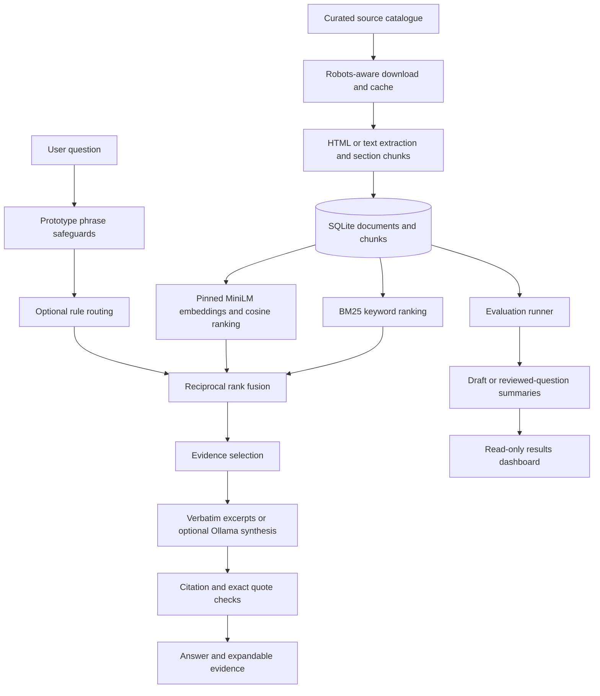

# WellQuery architecture

## Decisions and tradeoffs

- **SQLite and exact vector scans:** sufficient for 201 chunks and easy to run locally. This trades large-scale performance for a smaller student-project setup. The original PostgreSQL/Azure plan was intentionally reduced.
- **BM25 + MiniLM + RRF:** distinct methods make a comparison experiment possible. RRF combines ranks rather than incompatible raw score scales. Exact cosine search avoids a separate vector service.
- **Pinned embedding revision and corpus fingerprint:** document changes invalidate the persisted vector snapshot. The model is explicitly downloaded during index setup; ordinary searches use local files.
- **Rule routing:** a transparent local comparison baseline. Drug/condition/mixed cues are not a trained classifier or an out-of-scope detector. No trained local MediBot classifier artifacts were supplied.
- **Excerpts by default:** supports a working demo without another model service. Source wording and citations can be inspected directly, though passage selection can still be irrelevant or incomplete.
- **Optional synthesis:** local Ollama receives the question and evidence. JSON claims must cite evidence IDs and quote exact support text. This validates provenance structure, not claim entailment. It must be evaluated independently before quality claims.
- **Evaluation as data:** JSON/CSV artifacts keep metrics reproducible and inspectable. Review packets guard against accidentally applying decisions to changed questions. Reviewer identity is self-attributed, not authenticated.

## Boundaries

The app does not persist chat questions or answers. The browser displays conversation content until reload. The evaluation runner persists its specified test questions and outputs locally, not user conversations. The dashboard exposes only aggregate local evaluation summaries, not the review-answer files.

Do not infer Canadian residency guarantees: the local mode performs local inference, but installation and corpus downloads contact external providers. The original Databricks mode sends questions to configured remote services. There is no deployment, authentication, production privacy guarantee, or clinical validation in this demo.

## Original versus new work

The first import preserved MediBot's backend, local model wrapper, and UI with hashes recorded in `docs/medibot-baseline.json`. WellQuery adds local ingestion/storage, keyword/vector/hybrid search, rule routing, request/error handling, excerpts and evidence checks, the redesigned evidence interface, evaluation, and review/dashboard tooling. Git history and `ATTRIBUTION.md` record this evolution.
